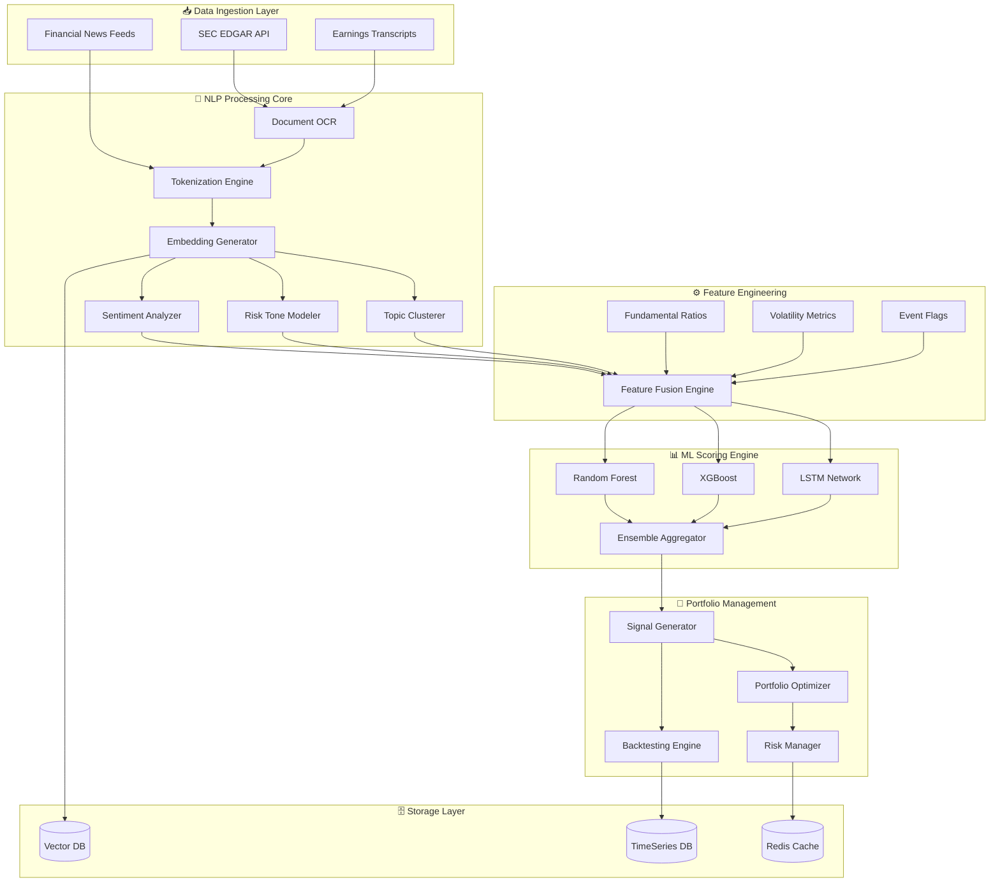
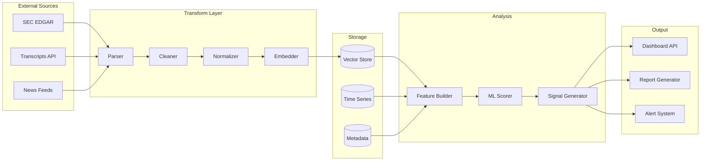
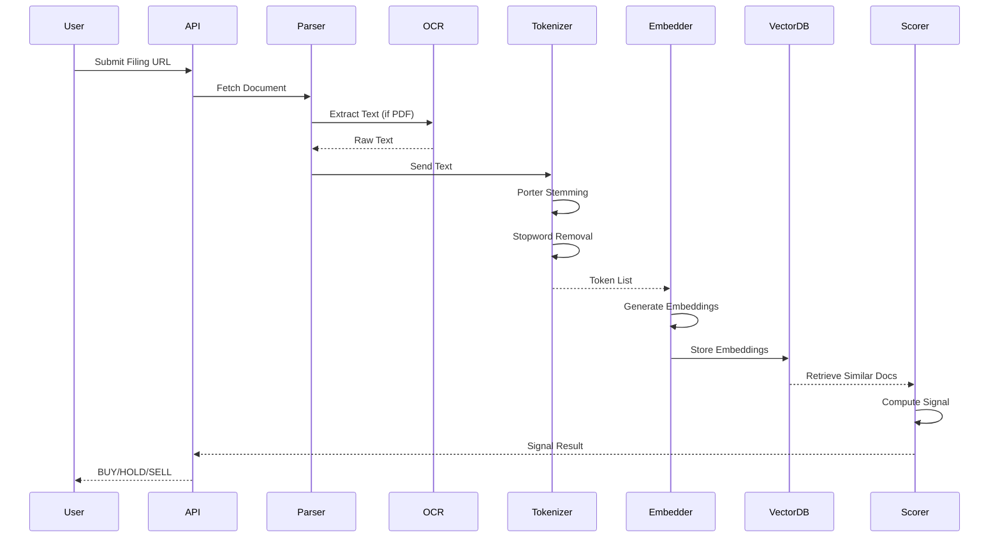
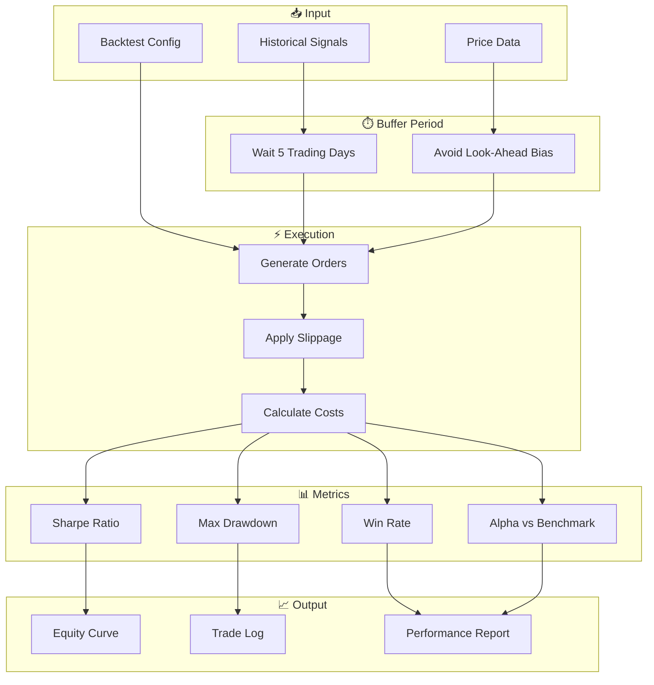
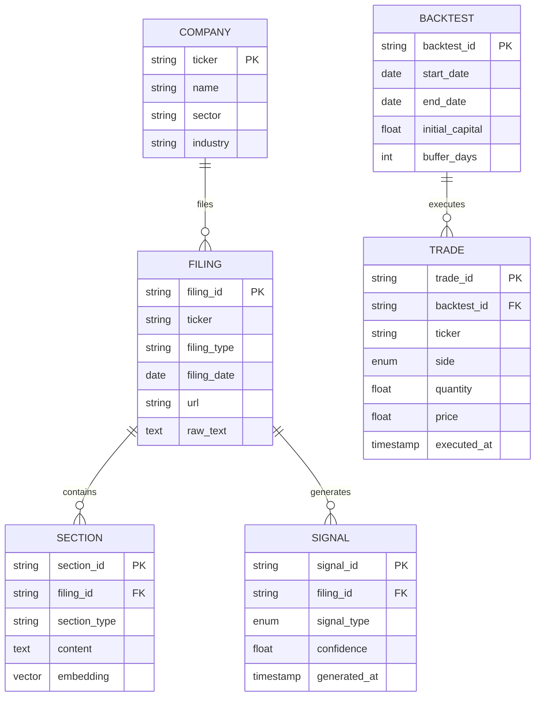
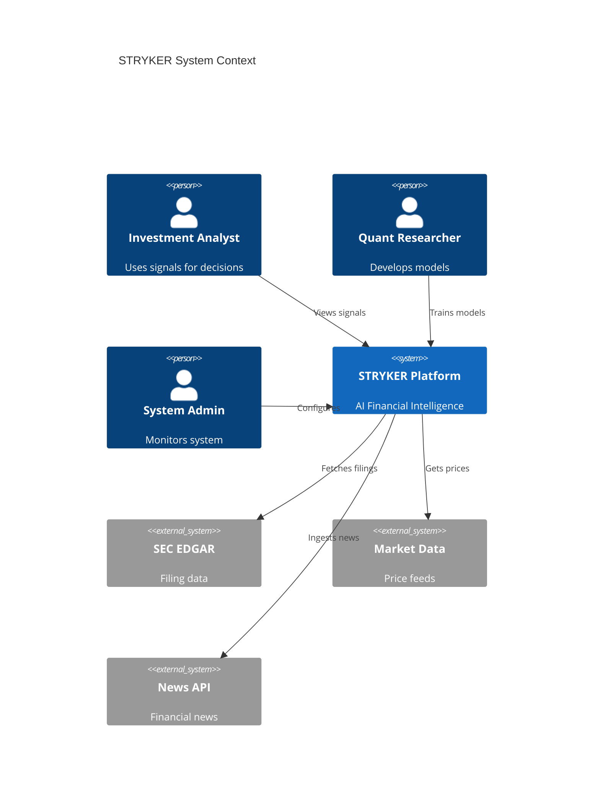

# System Architecture Diagram

```mermaid
flowchart TB
    subgraph DataIngestion["📥 Data Ingestion Layer"]
        SEC["SEC EDGAR API"]
        EARN["Earnings Transcripts"]
        NEWS["Financial News Feeds"]
    end

    subgraph NLPCore["🧠 NLP Processing Core"]
        OCR["Document OCR"]
        TOK["Tokenization Engine"]
        EMB["Embedding Generator"]
        SENT["Sentiment Analyzer"]
        RISK["Risk Tone Modeler"]
        TOPIC["Topic Clusterer"]
    end

    subgraph FeatureEng["⚙️ Feature Engineering"]
        FUND["Fundamental Ratios"]
        VOL["Volatility Metrics"]
        EVENT["Event Flags"]
        FUSION["Feature Fusion Engine"]
    end

    subgraph MLEngine["📊 ML Scoring Engine"]
        RF["Random Forest"]
        XGB["XGBoost"]
        LSTM["LSTM Network"]
        ENS["Ensemble Aggregator"]
    end

    subgraph Portfolio["💼 Portfolio Management"]
        BACK["Backtesting Engine"]
        SIG["Signal Generator"]
        ALLOC["Portfolio Optimizer"]
        RISK_MGR["Risk Manager"]
    end

    subgraph Storage["🗄️ Storage Layer"]
        VDB[("Vector DB")]
        TSDB[("TimeSeries DB")]
        CACHE[("Redis Cache")]
    end

    %% Data Flow
    SEC --> OCR
    EARN --> OCR
    NEWS --> TOK
    
    OCR --> TOK
    TOK --> EMB
    EMB --> VDB
    
    EMB --> SENT
    EMB --> RISK
    EMB --> TOPIC
    
    SENT --> FUSION
    RISK --> FUSION
    TOPIC --> FUSION
    FUND --> FUSION
    VOL --> FUSION
    EVENT --> FUSION
    
    FUSION --> RF
    FUSION --> XGB
    FUSION --> LSTM
    
    RF --> ENS
    XGB --> ENS
    LSTM --> ENS
    
    ENS --> SIG
    SIG --> BACK
    BACK --> TSDB
    
    SIG --> ALLOC
    ALLOC --> RISK_MGR
    RISK_MGR --> CACHE
```

---

# Data Flow Diagram (DFD)

```mermaid
flowchart LR
    subgraph External["External Sources"]
        A["SEC EDGAR"]
        B["Transcripts API"]
        C["News Feeds"]
    end

    subgraph Transform["Transform Layer"]
        D["Parser"]
        E["Cleaner"]
        F["Normalizer"]
        G["Embedder"]
    end

    subgraph Store["Storage"]
        H[("Vector Store")]
        I[("Time Series")]
        J[("Metadata")]
    end

    subgraph Analyze["Analysis"]
        K["Feature Builder"]
        L["ML Scorer"]
        M["Signal Generator"]
    end

    subgraph Output["Output"]
        N["Dashboard API"]
        O["Report Generator"]
        P["Alert System"]
    end

    A --> D
    B --> D
    C --> D
    
    D --> E --> F --> G
    G --> H
    
    H --> K
    I --> K
    J --> K
    
    K --> L --> M
    
    M --> N
    M --> O
    M --> P
```

---

# NLP Pipeline Sequence

```mermaid
sequenceDiagram
    participant User
    participant API
    participant Parser
    participant OCR
    participant Tokenizer
    participant Embedder
    participant VectorDB
    participant Scorer

    User->>API: Submit Filing URL
    API->>Parser: Fetch Document
    Parser->>OCR: Extract Text (if PDF)
    OCR-->>Parser: Raw Text
    Parser->>Tokenizer: Send Text
    Tokenizer->>Tokenizer: Porter Stemming
    Tokenizer->>Tokenizer: Stopword Removal
    Tokenizer-->>Embedder: Token List
    Embedder->>Embedder: Generate Embeddings
    Embedder->>VectorDB: Store Embeddings
    VectorDB-->>Scorer: Retrieve Similar Docs
    Scorer->>Scorer: Compute Signal
    Scorer-->>API: Signal Result
    API-->>User: BUY/HOLD/SELL
```

---

# Backtesting Flow

```mermaid
flowchart TB
    subgraph Input["📥 Input"]
        SIGNALS["Historical Signals"]
        PRICES["Price Data"]
        CONFIG["Backtest Config"]
    end

    subgraph Buffer["⏱️ Buffer Period"]
        B1["Wait 5 Trading Days"]
        B2["Avoid Look-Ahead Bias"]
    end

    subgraph Execution["⚡ Execution"]
        E1["Generate Orders"]
        E2["Apply Slippage"]
        E3["Calculate Costs"]
    end

    subgraph Metrics["📊 Metrics"]
        M1["Sharpe Ratio"]
        M2["Max Drawdown"]
        M3["Win Rate"]
        M4["Alpha vs Benchmark"]
    end

    subgraph Output["📈 Output"]
        O1["Equity Curve"]
        O2["Trade Log"]
        O3["Performance Report"]
    end

    SIGNALS --> B1
    PRICES --> B2
    CONFIG --> E1
    
    B1 --> E1
    B2 --> E1
    
    E1 --> E2 --> E3
    E3 --> M1
    E3 --> M2
    E3 --> M3
    E3 --> M4
    
    M1 --> O1
    M2 --> O2
    M3 --> O3
    M4 --> O3
```

---

# Entity Relationship Diagram

```mermaid
erDiagram
    FILING ||--o{ SECTION : contains
    FILING ||--o{ SIGNAL : generates
    FILING {
        string filing_id PK
        string ticker
        string filing_type
        date filing_date
        string url
        text raw_text
    }
    
    SECTION {
        string section_id PK
        string filing_id FK
        string section_type
        text content
        vector embedding
    }
    
    SIGNAL {
        string signal_id PK
        string filing_id FK
        enum signal_type
        float confidence
        timestamp generated_at
    }
    
    COMPANY ||--o{ FILING : files
    COMPANY {
        string ticker PK
        string name
        string sector
        string industry
    }
    
    BACKTEST ||--o{ TRADE : executes
    BACKTEST {
        string backtest_id PK
        date start_date
        date end_date
        float initial_capital
        int buffer_days
    }
    
    TRADE {
        string trade_id PK
        string backtest_id FK
        string ticker
        enum side
        float quantity
        float price
        timestamp executed_at
    }
```

---

# C4 Context Diagram

```mermaid
C4Context
    title STRYKER System Context

    Person(analyst, "Investment Analyst", "Uses signals for decisions")
    Person(quant, "Quant Researcher", "Develops models")
    Person(admin, "System Admin", "Monitors system")

    System(stryker, "STRYKER Platform", "AI Financial Intelligence")

    System_Ext(sec, "SEC EDGAR", "Filing data")
    System_Ext(market, "Market Data", "Price feeds")
    System_Ext(news, "News API", "Financial news")

    Rel(analyst, stryker, "Views signals")
    Rel(quant, stryker, "Trains models")
    Rel(admin, stryker, "Configures")
    
    Rel(stryker, sec, "Fetches filings")
    Rel(stryker, market, "Gets prices")
    Rel(stryker, news, "Ingests news")
```
